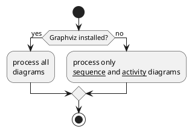

# SmartBoard uC Software

In diesem Repo wird die Software für den Mikrocontroller des SmartBoards entwickelt.
Das Ziel ist es, eine möglichst schlanke und günstige Software zu bauen, die dennoch im
Messmodus eine maximale Performance bringt.

## Hardware

Zum jetzigen Zeitpunkt wird auf einem ESP32 WROOM E verwendet dieser besitzt zwei Kerne und 
einen BLE chip der ADC ist nicht der beste weshalb vielleicht in Zukunft auf einen anderen Chip
gewechselt werden könnte.

## Softwarestruktur

Grob hat die Anwendung zwei Aufgaben:
    1. Das Messsignal aufnehmen
    2. Messsignal per BLE an Handyapp schicken

Außerdem soll der Controller bei nicht Verwendung schlafen gelegt werden.
Eventuell soll die App noch die Frequenz der Messpunkte anfordern können, um bei 
weniger Zeitkritischen Messungen Energie sparen zu können.
Hierfür sollen Strommessungen durchgeführt werden mit verschiedenen Abtastfrequenzen.

## uml: state diagram
